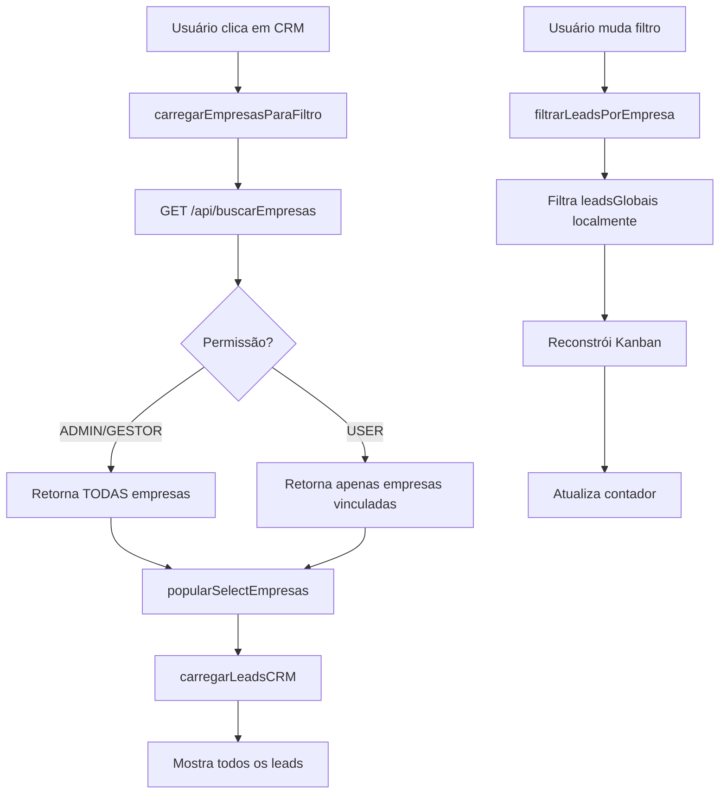

# ✅ Filtro de Empresa no CRM - Resumo de Implementação

## 🎯 O Que Foi Feito

Foi adicionado um **select/dropdown** no painel CRM que permite filtrar leads por empresa, respeitando o sistema de permissionamento existente do projeto.

---

## 📍 Onde Está Localizado

**No painel CRM**, logo abaixo do título "CRM - Funil de Vendas":

```
┌─────────────────────────────────────────────────┐
│ CRM - Funil de Vendas        [+ Adicionar Lead] │
├─────────────────────────────────────────────────┤
│ 🏢 Filtrar por Empresa:                         │
│ ┌──────────────────────────┐  📊 25 leads       │
│ │ Empresa ABC            ▼ │     encontrados    │
│ └──────────────────────────┘                    │
├─────────────────────────────────────────────────┤
│                                                 │
│  Entrou │ Agendou │ Analisando │ Fechou         │
│  [cards] [cards]   [cards]      [cards]         │
└─────────────────────────────────────────────────┘
```

---

## 🔐 Como Funciona o Permissionamento

### 👤 Usuário ADMIN ou GESTOR
- **Vê:** Opção "🌐 Todas as Empresas" + lista completa de empresas
- **Pode:** Filtrar por qualquer empresa ou ver todas de uma vez

### 👤 Usuário USER
- **Vê:** Apenas empresas que tem permissão (vinculadas na tabela `usuario_empresa`)
- **Não vê:** Opção "Todas as Empresas"
- **Comportamento:** Se tem apenas 1 empresa, ela já vem selecionada automaticamente

---

## 🚀 Como Usar

### Para o Usuário Final:

1. **Abrir o CRM:**
   - Clique no menu lateral em "CRM"
   - O sistema carrega automaticamente as empresas disponíveis

2. **Filtrar por Empresa:**
   - Clique no dropdown "Filtrar por Empresa"
   - Selecione a empresa desejada
   - Os leads são filtrados **instantaneamente**

3. **Ver Estatística:**
   - Ao lado do filtro aparece: "X leads encontrados"
   - Número atualiza automaticamente ao trocar de empresa

---

## 🔧 Arquivos Modificados

### 1. **public/index.html**
**O que foi adicionado:**
- Select de filtro de empresas
- Label "Filtrar por Empresa:"
- Contador "X leads encontrados"

**Linha:** 316-340

### 2. **public/js/crm.js**
**Funções criadas:**
- `carregarEmpresasParaFiltro()` - Busca empresas do backend
- `popularSelectEmpresas()` - Preenche o dropdown
- `filtrarLeadsPorEmpresa()` - Filtra leads por empresa
- `atualizarInfoLeadsFiltrados()` - Atualiza contador

**Linhas:** 1-150 (funções novas) + modificações nas linhas 230-280

### 3. **docs/FILTRO-EMPRESA-CRM.md** (NOVO)
Documentação completa de 400 linhas com:
- Fluxo de funcionamento
- Estrutura de dados
- Como testar
- Troubleshooting

---

## 📊 Fluxo Técnico Simplificado



---

## 🧪 Testes Recomendados

### ✅ Teste 1: ADMIN
```
1. Login como ADMIN
2. Abrir CRM
3. Verificar: Dropdown tem "🌐 Todas as Empresas"
4. Selecionar empresa específica → deve filtrar
5. Voltar para "Todas" → deve mostrar todos
```

### ✅ Teste 2: USER com 2+ empresas
```
1. Login como USER (empresas 1 e 2)
2. Abrir CRM
3. Verificar: Dropdown NÃO tem "Todas as Empresas"
4. Verificar: Só mostra empresas 1 e 2
5. Trocar entre empresas → filtra corretamente
```

### ✅ Teste 3: USER com 1 empresa
```
1. Login como USER (apenas empresa 1)
2. Abrir CRM
3. Verificar: Empresa 1 já vem selecionada
4. Verificar: Só mostra leads da empresa 1
```

---

## 🐛 Problemas Comuns e Soluções

### Problema: Select vazio ou "Carregando empresas..."
**Causa:** Backend não retornou empresas  
**Solução:** Verificar se usuário tem empresas vinculadas:
```sql
SELECT * FROM usuario_empresa WHERE usuario_id = X;
```

### Problema: Filtro não funciona
**Causa:** Leads não têm `empresa_id`  
**Solução:** Verificar se leads foram inseridos com `empresa_id` no JSONB:
```sql
SELECT dados_originais->>'empresa_id' FROM leads LIMIT 5;
```

### Problema: USER vê todas as empresas
**Causa:** Backend não filtra por permissão  
**Solução:** Verificar `EmpresaController.buscarEmpresas()` - deve filtrar por `usuario_empresa`

---

## 📈 Benefícios

### ✅ Para o Usuário:
- **Organização:** Foca apenas nas empresas relevantes
- **Performance:** Menos leads na tela = mais rápido
- **Clareza:** Sabe exatamente quantos leads tem por empresa

### ✅ Para o Sistema:
- **Sem Sobrecarga:** Filtro é local (não recarrega do servidor)
- **Reutiliza API:** Usa endpoint `/buscarEmpresas` que já existia
- **Compatível:** Não quebra nenhuma funcionalidade existente

---

## 🔄 Compatibilidade

### ✅ Mantém Funcionando:
- Drag & Drop de leads entre colunas
- Pop-up de detalhes do lead
- Adicionar/editar comentários
- Adicionar lead manual
- Todos os outros painéis do sistema

### ✅ Integra Com:
- Sistema de sessão (`req.session.user`)
- Permissionamento global (ADMIN/GESTOR/USER)
- Tabela `usuario_empresa` (vinculação usuário-empresa)

---

## 📝 Próximos Passos (Opcional)

Se quiser expandir no futuro:

1. **Busca por Nome:** Input de texto para buscar leads
2. **Filtros Múltiplos:** Selecionar várias empresas ao mesmo tempo
3. **Filtro por Origem:** Google Sheets, Site, Facebook, etc.
4. **Filtro por Data:** Range de datas (última semana, mês, etc.)
5. **Salvar Preferência:** LocalStorage para lembrar última empresa selecionada

---

## 📖 Documentação Completa

Para mais detalhes técnicos, consulte:
- **docs/FILTRO-EMPRESA-CRM.md** - Documentação técnica completa (400 linhas)

---

## ✅ Status Final

**Status:** ✅ Implementado e Pronto para Uso  
**Compatibilidade:** 100% com sistema existente  
**Permissionamento:** Funciona corretamente para ADMIN/GESTOR/USER  
**Performance:** Otimizado (filtro local, sem recarregar servidor)  

---

**🎉 Implementação concluída com sucesso!**
