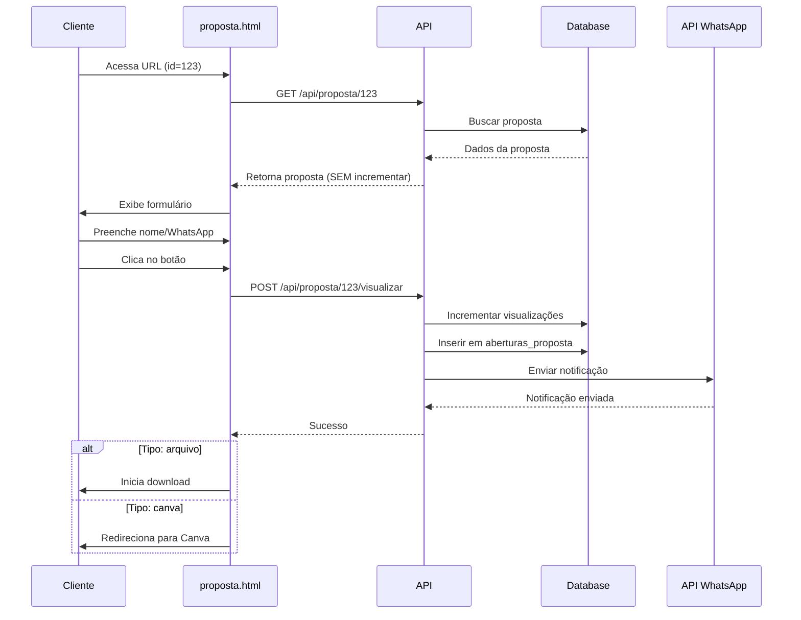

# 📱 Sistema de Notificações de Propostas

## 🎯 Funcionalidades Implementadas

### 1️⃣ **Contador de Visualizações**

O contador de visualizações agora funciona corretamente:

- ✅ **NÃO incrementa** ao abrir a página `proposta.html` pela primeira vez
- ✅ **INCREMENTA** apenas quando o cliente clica no botão de ação:
  - Botão "Download Proposta" (tipo: arquivo)
  - Botão "Quero ver!" (tipo: canva)
- ✅ **INCREMENTA a cada clique**, permitindo múltiplas visualizações do mesmo cliente
- ✅ Registra cada abertura na tabela `aberturas_proposta` com dados do cliente

### 2️⃣ **Notificações WhatsApp Automáticas**

Sempre que uma proposta for acessada/baixada, uma notificação é enviada automaticamente:

#### 📲 Número de Destino
```
Número padrão: 5541996616801
```

Este número recebe TODAS as notificações de propostas acessadas.

#### 📝 Formato da Mensagem

**Para propostas tipo "arquivo" (download):**
```
🚀 *NOVA AÇÃO EM PROPOSTA!*

📥 BAIXOU a proposta: *Nome da Proposta*

👤 Cliente: João Silva
📱 WhatsApp: (41) 99999-9999
🏢 Empresa: Empresa XYZ
🔢 Visualizações totais: 5
📅 Data: 20/10/2025 14:30:45
```

**Para propostas tipo "canva" (visualização):**
```
🚀 *NOVA AÇÃO EM PROPOSTA!*

👁️ ACESSOU a proposta: *Nome da Proposta*

👤 Cliente: Maria Santos
🏢 Empresa: Empresa ABC
🔢 Visualizações totais: 3
📅 Data: 20/10/2025 15:20:10
```

#### 🔧 Configuração da API WhatsApp

A mesma configuração do `NotificacaoScheduler`:

```javascript
URL: https://api.z-api.io/instances/3CBDE51FB92DD0F8E8DA98C0E1F09AEC/token/95E3C7C22E00D2CFAA81DAB9/send-text
Client-Token: 95E3C7C22E00D2CFAA81DAB9F0DAC7E4
```

### 3️⃣ **Fluxo Completo de Funcionamento**



## 📊 Dados Registrados

### Tabela `propostas`
- `visualizacoes`: Incrementado a cada clique no botão
- `status`: Atualizado para "Aberta" na primeira visualização

### Tabela `aberturas_proposta`
Cada clique no botão registra:
- `proposta_id`: ID da proposta
- `nome_acesso`: Nome do cliente
- `wpp_acesso`: WhatsApp do cliente (se fornecido)
- `ip`: IP do cliente
- `data_abertura`: Data e hora da ação

## 🛡️ Tratamento de Erros

### Notificação WhatsApp
- ✅ Erros na notificação **NÃO bloqueiam** o acesso à proposta
- ✅ Logs detalhados de sucesso/erro no console
- ✅ Cliente não percebe se a notificação falhou

### Registro de Aberturas
- ✅ Erros no registro **NÃO bloqueiam** o acesso à proposta
- ✅ Apenas gera warning no log

## 🎨 Exemplos de Uso

### Cenário 1: Cliente baixa proposta pela primeira vez
```
1. Cliente acessa: https://seusite.com/proposta.html?id=5
2. Sistema busca proposta (visualizações = 10)
3. Cliente preenche formulário e clica "Download Proposta"
4. Sistema:
   - Incrementa visualizações para 11
   - Registra abertura na tabela
   - Envia notificação para 5541996616801
   - Inicia download do arquivo
```

### Cenário 2: Mesmo cliente acessa novamente
```
1. Cliente acessa: https://seusite.com/proposta.html?id=5
2. Sistema busca proposta (visualizações = 11)
3. Cliente preenche formulário e clica "Download Proposta"
4. Sistema:
   - Incrementa visualizações para 12
   - Registra NOVA abertura na tabela
   - Envia NOVA notificação para 5541996616801
   - Inicia download do arquivo
```

### Cenário 3: Proposta tipo Canva
```
1. Cliente acessa: https://seusite.com/proposta.html?id=8
2. Sistema busca proposta tipo "canva" (visualizações = 3)
3. Cliente preenche formulário e clica "Quero ver!"
4. Sistema:
   - Incrementa visualizações para 4
   - Registra abertura na tabela
   - Envia notificação "👁️ ACESSOU" para 5541996616801
   - Redireciona para link do Canva
```

## 🔄 Mudanças em Relação à Versão Anterior

| Aspecto | Antes | Agora |
|---------|-------|-------|
| **Incremento de visualizações** | Ao carregar a página | Ao clicar no botão de ação |
| **Múltiplas visualizações** | Não permitido | Permitido (cada clique conta) |
| **Notificação WhatsApp** | Não existia | Enviada a cada ação |
| **Número de notificação** | N/A | 5541996616801 (fixo) |
| **Registro de aberturas** | Apenas uma por cliente | Múltiplos registros possíveis |

## 📈 Análise de Dados

Com esse sistema, você pode analisar:

1. **Quantas vezes cada proposta foi visualizada** (campo `visualizacoes`)
2. **Quem acessou cada proposta** (tabela `aberturas_proposta`)
3. **Quando cada acesso aconteceu** (campo `data_abertura`)
4. **Taxa de conversão**:
   - Total de acessos únicos à página
   - Total de cliques no botão (visualizações)
   - Diferença = quantos abandonaram sem clicar

## 🚀 Próximos Passos Sugeridos

### Melhorias Futuras
1. **Número customizável**: Permitir configurar número de notificação por empresa
2. **Múltiplos destinatários**: Enviar para vários números
3. **Template de mensagem**: Permitir personalizar mensagem
4. **Dashboard de analytics**: Visualizar estatísticas de propostas
5. **Limitar notificações**: Enviar apenas primeira visualização (opcional)

### Configurações Adicionais
```javascript
// Exemplo de configuração futura no código:
const CONFIG_NOTIFICACAO = {
  numeroDestino: '5541996616801',
  enviarSempre: true, // false = apenas primeira vez
  incluirWhatsAppCliente: true,
  incluirIP: false,
  templateCustomizado: null
};
```

## 🐛 Troubleshooting

### Notificação não está sendo enviada
1. Verificar credenciais da API Z-API
2. Verificar formato do número (deve incluir código do país)
3. Verificar logs do servidor para erros

### Visualizações não estão incrementando
1. Verificar se o botão está chamando o endpoint correto
2. Verificar logs do navegador (F12)
3. Verificar se tabela `propostas` tem campo `visualizacoes`

### Cliente não recebe a proposta
1. Verificar se proposta existe no banco
2. Verificar se arquivo/link está configurado corretamente
3. Verificar logs de erro no backend
