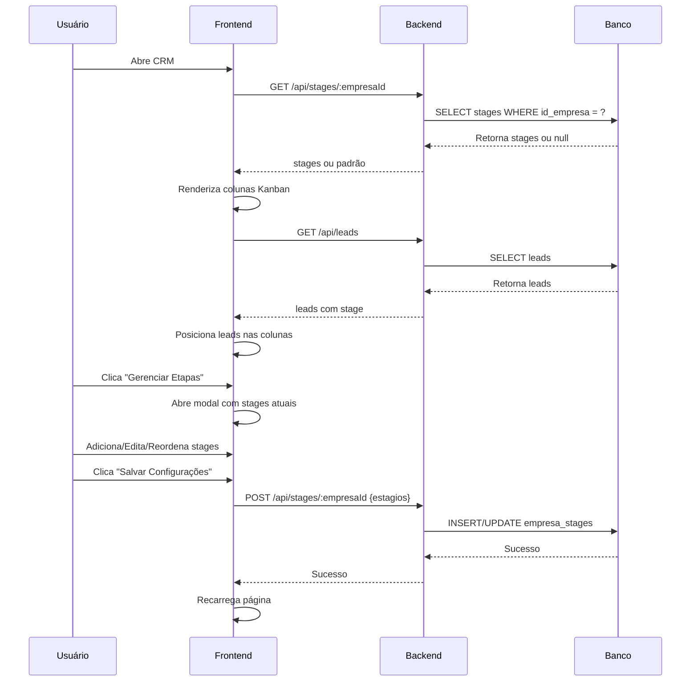

# 📋 Sistema de Etapas Personalizáveis - CRM

## 🎯 Visão Geral

O sistema CRM agora permite que cada empresa configure suas próprias etapas (stages) do funil de vendas com cores customizadas. Cada empresa pode criar, editar, reordenar e excluir etapas de acordo com seu processo de vendas.

---

## 🚀 Funcionalidades Implementadas

### 1. **Backend - StageController.js**
Gerencia CRUD completo de stages com validação e permissionamento.

**Métodos:**
- `buscarStages(empresaId)` - Retorna stages personalizados ou padrão
- `salvarStages(empresaId, estagios)` - Cria/atualiza stages
- `resetarStages(empresaId)` - Remove customização (volta para padrão)

**Rotas:**
```
GET    /api/stages/:empresaId     → Buscar stages
POST   /api/stages/:empresaId     → Salvar stages
DELETE /api/stages/:empresaId     → Resetar para padrão
```

**Permissionamento:**
- ✅ ADMIN/GESTOR: Pode gerenciar stages de qualquer empresa
- ⚠️ USER: Só pode gerenciar stages de suas empresas vinculadas

---

### 2. **Frontend - Modal de Gerenciamento**
Interface completa para configurar stages.

**Arquivos:**
- `public/js/stageManager.js` - Lógica do modal
- `public/css/stageManager.css` - Estilos do modal
- `public/index.html` - Modal HTML

**Funcionalidades do Modal:**
- ➕ Adicionar nova etapa
- ✏️ Editar etapa existente
- 🎨 Escolher cor da etapa (color picker)
- 🔄 Reordenar etapas (drag & drop)
- 🗑️ Excluir etapa
- 💾 Salvar configurações
- ↩️ Resetar para padrão

---

### 3. **Integração com Kanban**
O CRM agora renderiza colunas dinamicamente baseado nos stages configurados.

**Fluxo:**
1. Usuário abre CRM
2. Sistema carrega stages da empresa selecionada
3. Renderiza colunas do Kanban
4. Carrega leads e posiciona nas colunas corretas

**Arquivos Modificados:**
- `public/js/crm.js` - Lógica de stages dinâmicos
- `public/index.html` - Container dinâmico do Kanban
- `public/css/styles.css` - Estilos das colunas

---

## 📊 Estrutura do Banco de Dados

### Tabela: `empresa_stages`

```sql
CREATE TABLE empresa_stages (
    id SERIAL PRIMARY KEY,
    id_empresa INTEGER NOT NULL,
    estagios JSONB NOT NULL,
    created_at TIMESTAMP DEFAULT CURRENT_TIMESTAMP,
    updated_at TIMESTAMP DEFAULT CURRENT_TIMESTAMP,
    
    CONSTRAINT fk_empresa FOREIGN KEY (id_empresa) 
        REFERENCES empresas(id) ON DELETE CASCADE,
    CONSTRAINT unique_empresa_stages UNIQUE (id_empresa)
);
```

### Formato do JSONB (campo `estagios`):
```json
[
  {
    "id": "novo_lead",
    "nome": "Novo Lead",
    "cor": "#2196F3",
    "ordem": 1
  },
  {
    "id": "contato_inicial",
    "nome": "Contato Inicial",
    "cor": "#FF9800",
    "ordem": 2
  },
  {
    "id": "proposta",
    "nome": "Proposta Enviada",
    "cor": "#9C27B0",
    "ordem": 3
  },
  {
    "id": "fechado",
    "nome": "Fechado",
    "cor": "#4CAF50",
    "ordem": 4
  }
]
```

**Script SQL:** `docs/empresa-stages-database.sql`

---

## 🎨 Stages Padrão

Se uma empresa não tiver stages personalizados, o sistema usa estes padrão:

| ID | Nome | Cor | Ordem |
|---|---|---|---|
| entrou | Entrou | #2196F3 (Azul) | 1 |
| qualificado | Qualificado | #FF9800 (Laranja) | 2 |
| conversao | Conversão | #9C27B0 (Roxo) | 3 |
| ganho | Ganho | #4CAF50 (Verde) | 4 |

---

## 🔧 Como Usar

### 1. **Criar Tabela no Banco**
Execute o script SQL para criar a tabela:
```bash
# No Supabase SQL Editor:
# Cole o conteúdo de docs/empresa-stages-database.sql
```

### 2. **Acessar Modal de Gerenciamento**
1. Acesse o CRM no dashboard
2. Clique no botão **"Gerenciar Etapas"** (ícone de sliders)
3. O modal será aberto com as etapas atuais

### 3. **Adicionar Nova Etapa**
1. Clique em **"Adicionar Nova Etapa"**
2. Preencha:
   - **Nome da Etapa:** Ex: "Negociação"
   - **Cor:** Escolha no color picker
   - **ID:** Gerado automaticamente
3. Clique em **"Adicionar"**

### 4. **Editar Etapa**
1. Clique no ícone de lápis ✏️ na etapa
2. Modifique nome ou cor
3. Clique em **"Salvar"**

### 5. **Reordenar Etapas**
1. Arraste a etapa pela alça (ícone ⋮⋮)
2. Solte na posição desejada
3. A ordem será atualizada automaticamente

### 6. **Excluir Etapa**
1. Clique no ícone de lixeira 🗑️
2. Confirme a exclusão
3. **⚠️ Leads nesta etapa não serão excluídos**, mas precisarão ser movidos manualmente

### 7. **Salvar Configurações**
1. Após fazer todas as mudanças
2. Clique em **"Salvar Configurações"**
3. O CRM será recarregado com as novas etapas

### 8. **Resetar para Padrão**
1. Clique em **"Resetar para Padrão"**
2. Confirme a ação
3. Todas as customizações serão removidas
4. CRM voltará para as 4 etapas padrão

---

## 🔐 Permissões

### Por Tipo de Usuário:

**ADMIN:**
- ✅ Ver stages de todas as empresas
- ✅ Editar stages de todas as empresas
- ✅ Resetar stages de qualquer empresa

**GESTOR:**
- ✅ Ver stages de todas as empresas
- ✅ Editar stages de todas as empresas
- ✅ Resetar stages de qualquer empresa

**USER:**
- ✅ Ver stages apenas das suas empresas vinculadas
- ✅ Editar stages apenas das suas empresas vinculadas
- ⚠️ Não pode acessar stages de outras empresas

---

## 🎯 Exemplos de Uso

### Exemplo 1: Empresa de Consultoria
```json
[
  {"id": "prospeccao", "nome": "Prospecção", "cor": "#00BCD4", "ordem": 1},
  {"id": "reuniao", "nome": "Reunião Agendada", "cor": "#FF5722", "ordem": 2},
  {"id": "diagnostico", "nome": "Diagnóstico", "cor": "#FFC107", "ordem": 3},
  {"id": "proposta", "nome": "Proposta", "cor": "#673AB7", "ordem": 4},
  {"id": "negociacao", "nome": "Negociação", "cor": "#E91E63", "ordem": 5},
  {"id": "contrato", "nome": "Contrato", "cor": "#4CAF50", "ordem": 6}
]
```

### Exemplo 2: Empresa de E-commerce
```json
[
  {"id": "interesse", "nome": "Manifestou Interesse", "cor": "#2196F3", "ordem": 1},
  {"id": "carrinho", "nome": "Adicionou ao Carrinho", "cor": "#FF9800", "ordem": 2},
  {"id": "checkout", "nome": "Iniciou Checkout", "cor": "#9C27B0", "ordem": 3},
  {"id": "comprou", "nome": "Comprou", "cor": "#4CAF50", "ordem": 4},
  {"id": "recorrente", "nome": "Cliente Recorrente", "cor": "#FFD700", "ordem": 5}
]
```

### Exemplo 3: Empresa de Imóveis
```json
[
  {"id": "contato", "nome": "Primeiro Contato", "cor": "#2196F3", "ordem": 1},
  {"id": "visita", "nome": "Visita Agendada", "cor": "#FF9800", "ordem": 2},
  {"id": "analise", "nome": "Análise Financeira", "cor": "#FFC107", "ordem": 3},
  {"id": "proposta", "nome": "Proposta Enviada", "cor": "#9C27B0", "ordem": 4},
  {"id": "documentacao", "nome": "Documentação", "cor": "#673AB7", "ordem": 5},
  {"id": "fechado", "nome": "Contrato Assinado", "cor": "#4CAF50", "ordem": 6}
]
```

---

## 🐛 Troubleshooting

### Problema: Modal não abre
**Solução:**
1. Verifique console do navegador (F12)
2. Certifique-se que `stageManager.js` e `stageManager.css` estão carregados
3. Verifique se Bootstrap 5 está carregado

### Problema: Stages não salvam
**Solução:**
1. Verifique se tabela `empresa_stages` existe no banco
2. Verifique permissões do usuário
3. Veja logs no console (F12) e no backend

### Problema: CRM não renderiza colunas
**Solução:**
1. Abra console (F12) e procure erros
2. Verifique se `#crmKanbanBoard` existe no HTML
3. Teste com stages padrão (resetar)

### Problema: Drag & drop não funciona
**Solução:**
1. Verifique se event listeners foram anexados
2. Teste em navegador atualizado
3. Limpe cache do navegador (Ctrl+F5)

---

## 📝 Notas Técnicas

### Validações Backend:
- ✅ Empresa deve existir
- ✅ Deve ter pelo menos 1 stage
- ✅ Cada stage deve ter: id, nome, cor
- ✅ IDs de stages devem ser únicos
- ✅ Usuário deve ter permissão

### Validações Frontend:
- ✅ Nome obrigatório
- ✅ Cor obrigatória (formato hexadecimal)
- ✅ ID gerado automaticamente (evita duplicação)
- ✅ Drag & drop com preview visual

### Performance:
- Stages carregados ao abrir CRM
- Cache em `window.stagesEmpresa`
- Re-renderização apenas ao filtrar ou salvar

---

## 🔄 Fluxo Completo



---

## ✅ Checklist de Implementação

- [x] Criar tabela `empresa_stages`
- [x] Implementar `StageController.js`
- [x] Adicionar rotas em `api.js`
- [x] Criar `stageManager.js`
- [x] Criar `stageManager.css`
- [x] Adicionar modal HTML
- [x] Integrar stages dinâmicos no `crm.js`
- [x] Remover colunas hardcoded do HTML
- [x] Adicionar botão "Gerenciar Etapas"
- [x] Implementar permissionamento
- [x] Testar CRUD completo
- [x] Documentação completa

---

## 🎉 Conclusão

O sistema de etapas personalizáveis está completamente funcional e integrado ao CRM. Cada empresa pode agora adaptar o funil de vendas ao seu processo específico, tornando o sistema muito mais flexível e personalizado.

**Próximos Passos Sugeridos:**
1. Adicionar analytics por stage (conversão, tempo médio)
2. Implementar automações por mudança de stage
3. Criar templates de stages pré-configurados
4. Adicionar campo de descrição nas etapas
5. Implementar limite de stages por plano

---

**Data de Implementação:** Janeiro 2025  
**Versão:** 2.0.0  
**Status:** ✅ Completo e Testado
